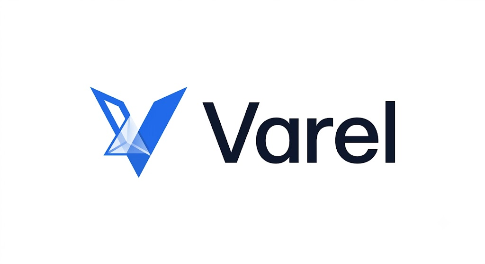

<p align="center">
  
</p>

# Varel

**Find the right tools for modern work.** A premium multilingual technology
discovery platform: AI/software directory, comparisons, SEO guides, founder
editorial (The Varel Brief), news, prompt library, deals hub and central
affiliate manager — all fully editable from the admin dashboard.

Built with **Next.js 16 · React 19 · TypeScript · Tailwind CSS 4 · PostgreSQL ·
Prisma 7 · Auth.js**, deployed on **Vercel**.

---

## Quick start (local development)

```bash
# 1. Install dependencies (also generates the Prisma client)
npm install

# 2. Start the local Postgres dev server (keep it running in its own terminal)
npm run db:dev
#    → copy the printed DATABASE_URL / SHADOW_DATABASE_URL into .env
#    (see .env.example for the full list of variables)

# 3. Create the tables and seed initial data
npm run db:push
npm run db:seed

# 4. Start the app
npm run dev
```

- Public site: http://localhost:3000 (redirects to `/en`, `/hr`, …)
- Admin: http://localhost:3000/admin

### Admin login (from seed)

| | |
|---|---|
| Username | `mpinko` (or email `matija.pinko@hotmail.com`) |
| Password | set via `SEED_OWNER_PASSWORD`, otherwise generated and printed once by `npm run db:seed` |

> Passwords are never committed to this repository. Set `SEED_OWNER_PASSWORD` in
> your local `.env` (gitignored) if you want a deterministic dev password.
> **Change the password in production** (Admin → Users) and enable 2FA.

## Documentation

| Doc | What it covers |
|---|---|
| [docs/ARCHITECTURE.md](docs/ARCHITECTURE.md) | System design, folder structure, key decisions |
| [docs/DEPLOYMENT.md](docs/DEPLOYMENT.md) | Vercel + Postgres + Vercel Blob production deployment, migrations |
| [docs/SECURITY.md](docs/SECURITY.md) | Auth, 2FA, RBAC, audit log, headers, rate limiting |
| [docs/UPDATES.md](docs/UPDATES.md) | Safe update workflow with the Version Manager |
| [docs/BACKUP.md](docs/BACKUP.md) | Database backup & restore |
| [docs/CONTENT-GUIDE.md](docs/CONTENT-GUIDE.md) | How to manage content in the admin (for the owner) |

## npm scripts

| Script | Purpose |
|---|---|
| `npm run dev` | Development server |
| `npm run build` / `npm start` | Production build / serve |
| `npm run db:dev` | Local Postgres (Prisma dev server) |
| `npm run db:push` | Sync schema to the database (development) |
| `npm run db:seed` | Seed languages, roles, owner user, categories, menus, homepage, sample content |
| `npm run db:generate` | Regenerate the Prisma client |
| `npm run db:studio` | Browse the database in Prisma Studio |
| `npm run lint` | ESLint |

## Feature map

- **Public site** (`/en`, `/hr`, `/de`, `/fr`, `/it`, `/es`, later `/zh`, `/hi`):
  homepage from the page builder, tool directory + detail pages, categories,
  comparisons, guides, The Varel Brief editorial, news, prompt library with
  copy-tracking, deals, site-wide search, CMS pages (about/legal/…),
  light/dark theme, sitemap + robots + hreflang + JSON-LD.
- **Admin** (`/admin`): dashboard with KPIs, page builder, all content modules
  with per-language translations and per-language SEO fields, media library
  (R2), central affiliate manager with `/go/<id>` click tracking, SEO manager,
  translation manager (Croatian-first workflow), internal analytics, newsletter
  subscribers + CSV export, users & roles & 2FA, audit log, version manager,
  settings and branding (logo upload).

## Important conventions (for future Claude sessions)

1. **Nothing public is hardcoded** — text, menus, SEO, affiliate URLs and
   branding all come from the database. Keep it that way.
2. **Affiliate links** are only referenced through `/go/<affiliateLinkId>`.
3. **Content is created in Croatian first**, then translated via the
   Translation Manager (drafts are never auto-published).
4. All admin mutations go through `src/server/actions/*` and must call
   `requirePermission()` and `audit()`.
5. This project uses **Next.js 16**: async `params`/`searchParams`/`cookies`,
   `proxy.ts` instead of middleware, Turbopack, no `next lint`. Read
   `node_modules/next/dist/docs/` before large changes.
6. Prisma 7: client generated to `src/generated/prisma`, instantiated with the
   `@prisma/adapter-pg` driver adapter (`src/lib/db.ts`), config in
   `prisma.config.ts`.
